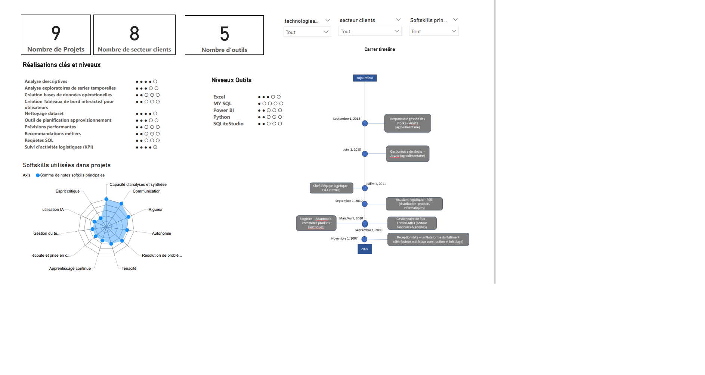
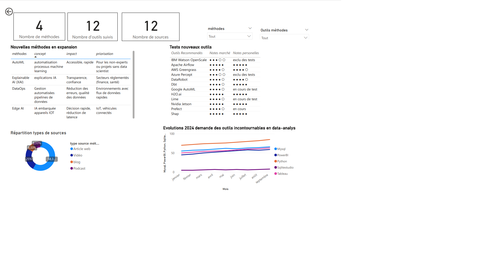

# Mon Portfolio Data-Analyst-Supply-Chain

Bienvenue sur mon portfolio de Data Analyst Supply-Chain!
Bienveillant, Curieux, Courageux j'ai aimé me former à  l'analyse de données et l'optimisation des chaînes d'approvisionnement. Fort de 15 années professionnelles dans le secteur logistique (chef de service logistique en entrepôt) je peux désormais combiner mes compétences et connaissances dans ce domaine avec l'analyse de données. Ce portfolio présente mes compétences en Data-Analyses , les projets que j'ai réalisés ainsi que des exemples de livrables pour répondre à des besoins spécifiques d'une offre d'emploi de data-analyst.

## À propos de moi
- **Nom :** [Beaussart Grégoire]
- **Age :** 36 ans
- **Résident :** Marne-la-Vallée (77)
- **Rôle :** Data Analyst Supply Chain
- **Compétences :**
  - Analyse de données (Python, Pandas, Excel, SQL)
  - Visualisation de données (Power BI, Tableau, Matplotlib, Seaborn)
  - Modélisation statistique (ANOVA, Régressions, K-means, moyennes mobiles, SARIMA)
  - Gestion des bases de données (MYSQL, SQLITESTUDIO)
  - Prévisions des ventes, Optimisation des stocks
  - Suivi et mise en place de KPI logistiques, tableaux de bords (Excel, PowerBi)

## Mon profil professionnel

Toutes mes compétences, maitrises des technologies de data analyse ainsi que mon parcours professionnel : c'est ici en version interactive PowerBi téléchargeable 
[Section_Profil](profil_professionnel.md)

## Mes projets

Les 9 projets de data-analyses réalisés:
[Section_Projets](projet.md)

## Vieille métier et technologique

Derniers outils, méthodes et évolutions en data-analyse: c'est ici en version interactive PowerBi téléchargeable 
[Section_Veille](veille_m%C3%A9tier_technologique.md)

## Démonstrations de mes compétences dans le cadre de contenus spécifiques pour l'offre d'emploi du client Aerosoft

Démonstrations de mes compétences pour l'offre d'emploi de data-analyst expert chez Aerosoft:
[Section_Aerosoft](demonstration_competences_candidature_offre_d_emploi_aerosoft.md)

## Me contacter
- **Email :** [beaussartgregoiredata@gmail.com]
- **LinkedIn :** [Votre lien LinkedIn]
